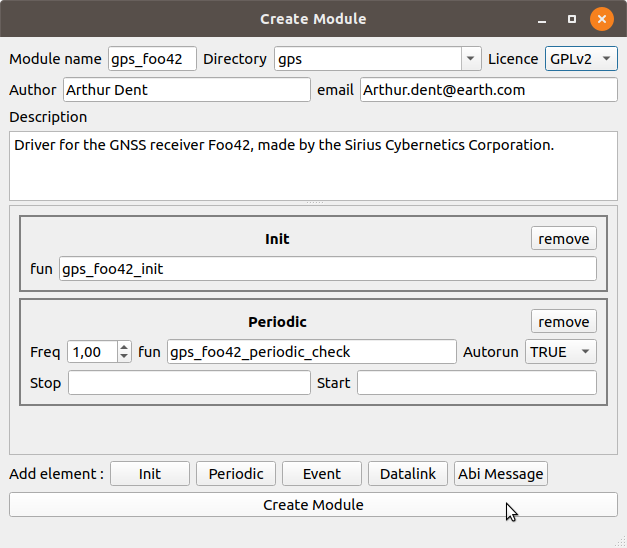

.. advanced develop_new_gps_driver

======================
Develop new GPS driver
======================

We will see in this tutorial how to develop a driver for a new GNSS receiver.

First, we create a new module. Use the Module Creator tool to ease this step. (In the Paparazzi Center: *Tools->Module Creator*)

Edit XML file
-------------

The generated module description file can be found in ``conf/modules``. You have to edit it to fit your needs. Here the file for my module :

.. code-block:: XML

    <!DOCTYPE module SYSTEM "module.dtd">
    <module name="gps_foo42" dir="gps">
      <doc>
        <description>Driver for the GNSS receiver Foo42, made by the Sirius Cybernetics Corporation.
        </description>
      </doc>
      <autoload name="gps"/>
      <header>
        <file name="gps_foo42.h"/>
      </header>
      <init fun="gps_foo42_init()"/>
      <periodic fun="gps_foo42_periodic_check()" freq="1.0" autorun="TRUE"/>
      <makefile>
        <file name="gps_foo42.c"/>
         <raw>
          ifdef SECONDARY_GPS
          ifneq (,$(findstring $(SECONDARY_GPS), foo42))
          # this is the secondary GPS
          $(TARGET).CFLAGS += -DGPS_SECONDARY_TYPE_H=\"modules/gps/gps_foo42.h\"
          $(TARGET).CFLAGS += -DSECONDARY_GPS=GPS_FOO42
          else
          $(TARGET).CFLAGS += -DGPS_TYPE_H=\"modules/gps/gps_foo42.h\"
          $(TARGET).CFLAGS += -DPRIMARY_GPS=GPS_FOO42
          endif
          else
          # plain old single GPS usage
          $(TARGET).CFLAGS += -DGPS_TYPE_H=\"modules/gps/gps_foo42.h\"
          endif
        </raw>

      </makefile>
      <makefile target="fbw">
        <define name="USE_GPS"/>
      </makefile>
    </module>

This module depend on the ``gps`` module. It is automaticaly loaded with ``<autoload name="gps"/>``. You may also want to autoload simulated GPS to simulation sessions. In this case add the following autoloads:

.. code-block:: XML

    <autoload name="gps_nps"/>
    <autoload name="gps_sim"/>

The ``makefile`` node can be constrained to specified targets. If you develop a driver for a real sensor, you probably don't want it to be used in simulation. Add a ``target`` attribute to limit the use of your module to real autopilots only:

.. code-block:: XML

    <makefile target="ap|fbw">

.. note:: ``ap`` and ``fbw`` are the autopilot firmware names for real aircrafts.

Edit .h file
------------

Define ``PRIMARY_GPS`` like in the following code snippet in the ``.h`` file: this will automatically define your GPS as PRIMARY if no other is explicitely defined.

.. code-block:: C

    #ifndef PRIMARY_GPS
    #define PRIMARY_GPS GPS_FOO42
    #endif

If you specified an init function in the Module Creator, its prototype should appear here:

.. code-block:: C

    extern void gps_foo42_init(void);

You need to declare a ``struct GpsState`` to hold GPS information. It can also be wrapped in a custom struct if needed. The _GpsState_ structure must be passed as argument to the ``gps_periodic_check`` function. The easy way to do it is to make a macro that wrap this call:

.. code-block:: C

    extern struct GpsState gps_foo;
    #define gps_foo42_periodic_check() gps_periodic_check(&gps_foo)

.. note:: If you define this macro, you must then delete the function prototype and implementation that the Module Creator generated for you.

Add an ABI ID for your module
-----------------------------

In the file ``sw/airborne/subsystems/abi_sender_ids.h``  add a free ID for your module in the GPS section (around after line 205) :

.. code-block:: C

    #ifndef GPS_FOO42_ID
    #define GPS_FOO42_ID 16
    #endif

Edit .c file
------------

Define the global ``GpsState`` structure you declared in the .h file:

.. code-block:: C

    struct GpsState gps_foo;

Then initialise it in you init function. You should at least set the ``fix`` field (to false, assuming that you will not have a fix at the startup).

Set or Clear the ``valid_fields`` bits:

.. code-block:: C

    ClearBit(gps_foo.valid_fields, GPS_VALID_POS_ECEF_BIT);

.. note ::

    Valid fields are:
    
    + GPS_VALID_POS_ECEF_BIT
    + GPS_VALID_POS_LLA_BIT
    + GPS_VALID_POS_UTM_BIT
    + GPS_VALID_VEL_ECEF_BIT
    + GPS_VALID_VEL_NED_BIT
    + GPS_VALID_HMSL_BIT
    + GPS_VALID_COURSE_BIT

Write your driver to get GPS information.

Fill the ``GpsState`` structure to the best you can, and set the appropriate ``valid_fields`` bits.

Finally, send the GPS ABI message:

.. code-block:: C

    AbiSendMsgGPS(GPS_FOO42_ID, now_ts, &gps_foo);

.. note:: ``now_ts`` is the current timestamp defined by ``uint32_t now_ts = get_sys_time_usec();``.

To use your module, just add it to your airframe file in the *firmware* section: ``<module name="gps" type="foo42"/>``

